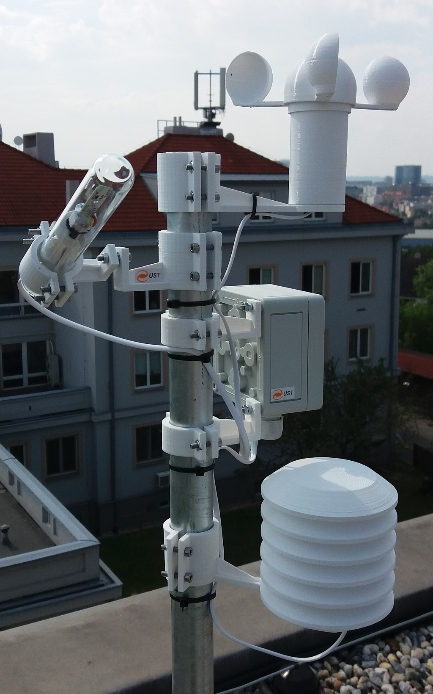

# AutomaticWeatherStation
Professional high quality 3D printed automatic weather station.  The special features are: 

* Easy station deployment due to self-calibrating wind gauge
* Modular construction allowing experiment specific modification
* Printed design allows easy and fast component replacement after externaly caused damage even in distant locations with difficult maintanance

Related sensors: 
 * [Venturi based wind sensor](https://github.com/mlab-modules/WINDGAUGE03)
 * [Hydrometeor distrometer](https://github.com/UniversalScientificTechnologies/DISTROMETER01)
 * [Cloud sensors](https://github.com/UniversalScientificTechnologies/MRAKOMER4)
